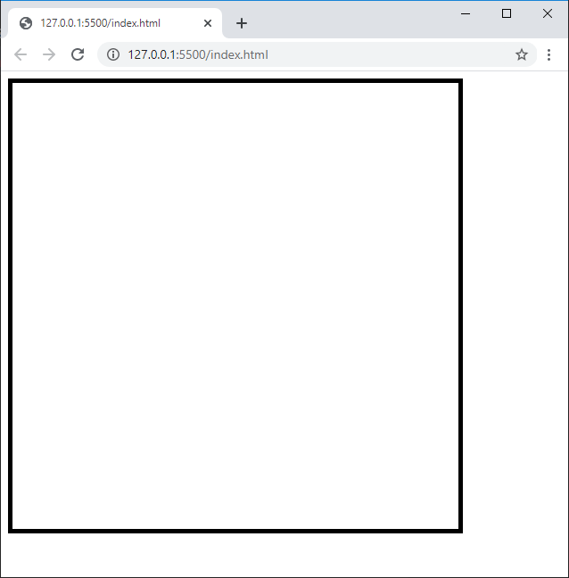

# Creació d'un joca amb JavaScript pas a pas

## Creació de la tela (canvas) de joc

1. Crear un fitxer anomenat [index.html](pasos/index_0001.html) amb el següent contingut.

```html
<canvas id="tela" width="500" height="500" style="border: 5px solid black;"></canvas>
```

### Explicació

Es crea un objecte del tipus [**```canvas```**](https://www.w3schools.com/html/html5_canvas.asp)


   Si obrim el fitxer index.html obtenim el següent:



```html
<canvas id="tela" width="500" height="500" style="border: 5px solid black;"></canvas>
<script>
    var ctx = document.getElementById("tela").getContext("2d"); // Context => ctx
    console.log(ctx);

    ctx.fillText("Sóc aquí!",50,50);
</script>

```
